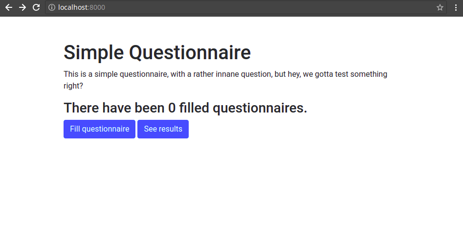
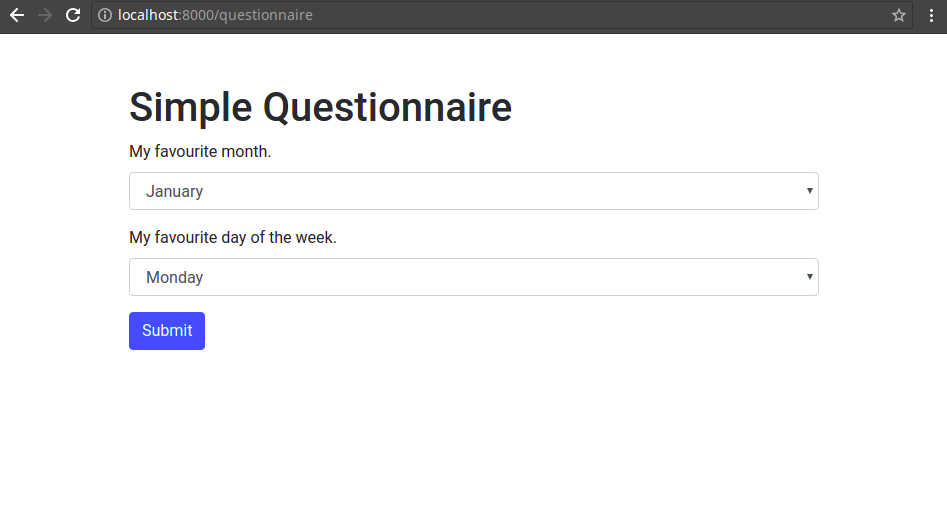
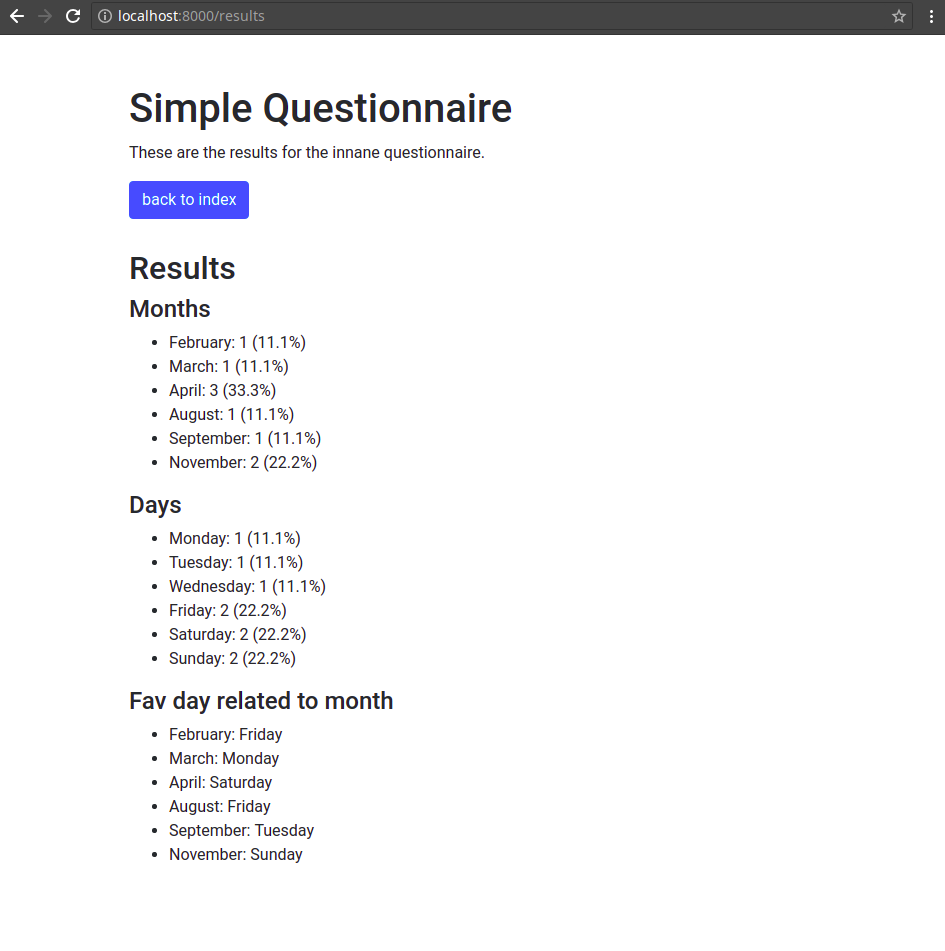

# Cloud Code test

This code test is to just fill the blanks of this rather simple (and mostly inane) questionnaire app.

The app is a Django application with 3 views (index, questionnaire and results), running in an Alpine linux container, with Gunicorn as the web server running Django, and just using the default sqlite3 database.

## App views:

### Index Page


The index page shows the total number of questionnaires filled, and provides links to the questionnaire and the results.

### Questionnaire Page


The questionnaire page is a simple web form that POSTs to the view, and is saved in the database.

The question it asks: What is your favourite month, and your favourite day of the week.

### Results Page


The results page will show the following stats about the filled questionnaires:
* The count of each month picked and what percent from the total that is.
* The count of each day picked and what percent from the total that is.
* The most chosen day, based on which month was picked (see picture)
  * e.g. of the people who all liked May, which day did they pick the most often.

## Your Tasks

### Fill in the blanks

#### Finish the docker file

The docker file is missing some key pieces to work (see the TODO notes).

After getting this file done, you should be able to run the docker commands as listed below in the development section, but you'll run into a problem that the next task will solve.

#### Finish the startup_check.py file

We're missing the part that tells us which migrations need to be run. Find the TODO and fill the missing logic.

#### Make the database model for the FilledQuestionnaire

Use the Django ORM to define a database model for the FilledQuestionnaires two questions. How you define this model, and how you store the data will affect on how you can process that data later into the results view.

You will also need to make the migration files for this, either using the method as described further down in this read me, or another way.

#### Build the Questionnaire View

This will be a view that asks for the month, and the day as drops downs in a form. A form POST to the view will save the data into the database model you made earlier.

This view should redirect back to the index when a questionnaire is POSTed and saved.

#### Make the index view count and display the number of FilledQuestionnaires

Query for the number items in the database, and add that to the context.

#### Build the results view

This view will need to query for the saved FilledQuestionnaire entries, then do some basic calculations, put the data into some useful collection structures, and the use that context data when rendering the Django template.


### Answer some questions

#### Explain how the config for this app works, and why when using docker compose might this be a good way to configure rather than a config file

#### Explain why the startup_check.py file exists and what it does

#### Explain what the entrypoint.sh file does


## Testing and evaluation

We will build and run the code as follows:
```
docker build -t local/cloud_test .
docker run -it --rm -p 8000:8000 --name test_site local/cloud_test
```
Which will build a clean container for us, and then run it.

We will also be looking through your code, and your commits. Try to commit as you get segments working, or some more changes through rather than one single final commit.


## Development environment

Here are some useful things to know about how this app works, or what kind of things to do via the development environment for it.

All docker commands below are run from the root of the repo.

### Build docker container

You only need to build/rebuild the container when you change requirements.

```
docker build -t local/cloud_test .
```

### Run docker container for development

If you have an existing sqlite database, or media files folder, you should place those in the `cloud_test_app` folder if you want them to be used.

For development you will want to mount all the app files, so that any changes to them are reflected in the running site:
```
docker run -it --rm -p 8000:8000 --name test_site \
  -v $(pwd)/cloud_test_app:/opt/cloud_test_app \
  local/cloud_test --hot-reload
```

The `--hot-reload` directive is passed to Gunicorn, and tells it to reload when code changes.

You can now access the site at http://localhost:8000/ and login to the django admin (if you need or want to) as `admin` with the password `adminpass`.

### Creating migration files

When you change the python code and need to create new migrations (or check if new ones are needed), you'll want to run the makemigrations command through the docker container environment.

Once you have a local container built, all you need to do is run the following command from the repo root folder:
```
docker run -it --rm -p 8000:8000 --name test_site \
  -v $(pwd)/cloud_test_app:/opt/cloud_test_app \
  local/cloud_test \
  --django-manage makemigrations
```

**Note**: These migrations files will be owned by 'root' because they were created within the scope of the container (using the container's root user). You may want to chown them (or your whole repo folder), but git doesn't really seem to mind, but if you notice any odd permissions issues around these files, this may be why.


## Startup checks

To facilitate easier upgrades and container rollovers we wanted each container to be safe to start up on it's own, and attempt to handle new migrations (if needed) and collection of static files.

The code for this is located in this same folder as `startup_check.py`.

This is run on every container start up and simply ensures that the database is in the state the container needs it to be to run.


## Config

### Django configuration

```shell
# via environment variables:
/opt/cloud_test_app/cloud_test/settings/config.py
# or settings override:
/opt/cloud_test_app/cloud_test/settings/local.py
```
`local.py` takes priority over `config.py` for any overridden variables.

See `cloud_test_app/cloud_test/settings/config.py` and the documentation
therein on how to configure the service with environmental variables.
See `cloud_test_app/cloud_test/settings/local.py.sample` for an example
of a `local.py` file.


### Gunicorn configuration

```shell
/etc/cloud_test/conf.py
```
Details for the setting options are here:
http://docs.gunicorn.org/en/stable/settings.html


## Libraries we are using

### Django Bootstrap 4

A useful and simple library for some bootstrap html setup in the templates.

See more: https://django-bootstrap4.readthedocs.io/en/latest/

### Django Database Locking

For our [startup checks](#startup-checks) we needed a locking mechanism, and
rather than writing our own we're using this existing library.

See more: https://github.com/vikingco/django-db-locking/
